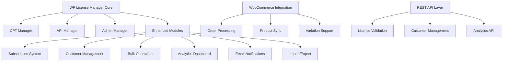
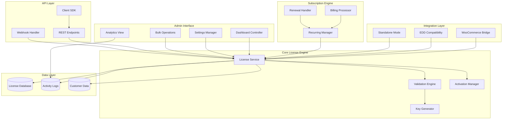
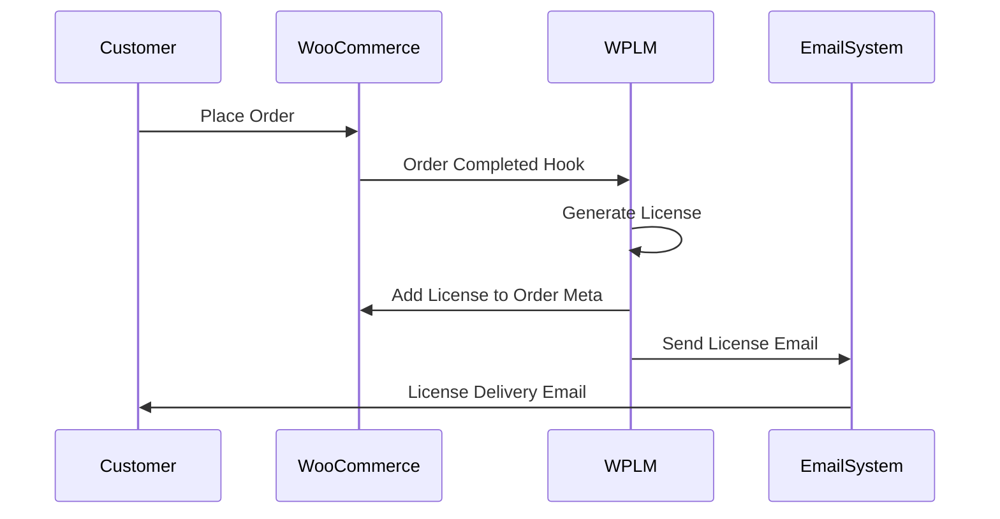
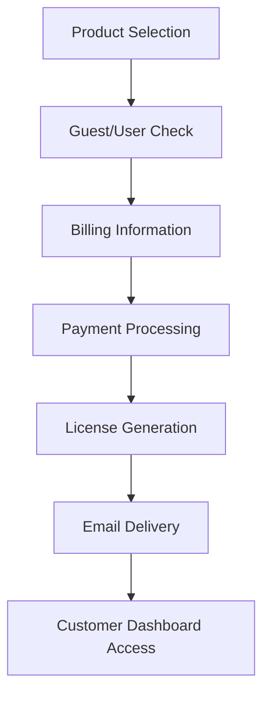
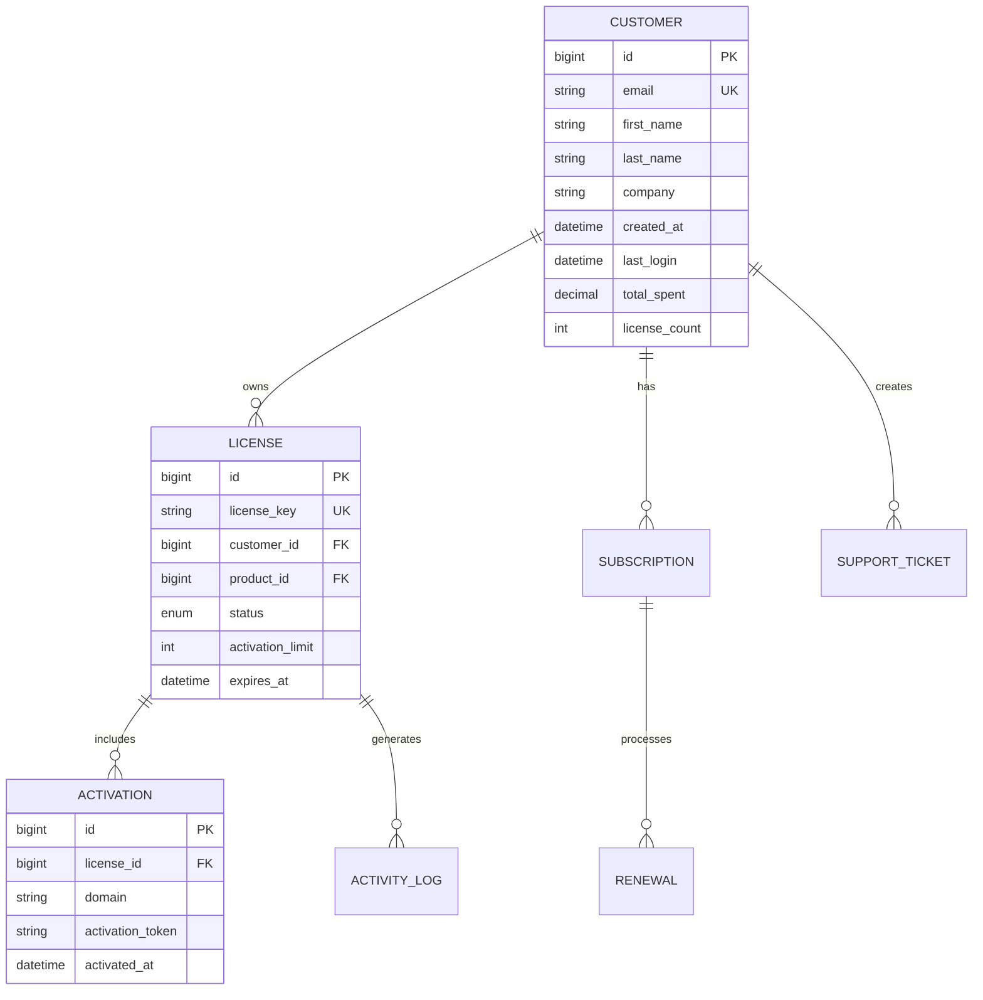

# WPLM Licensing Plugin: Chief-Programmer Review & Enhancement Design

## Overview

This design document outlines a comprehensive architectural review and enhancement plan for the WP License Manager (WPLM) plugin to transform it into an enterprise-grade WordPress licensing management system. The project aims to achieve feature parity with Easy Digital Downloads (EDD) licensing, provide seamless WooCommerce integration, implement built-in subscriptions, and deliver a best-in-class solution for selling digital products through license keys.

## Repository Type Analysis

Based on the codebase analysis, this is a **Full-Stack WordPress Plugin** with the following characteristics:
- Backend license management system with REST API
- Admin dashboard interface with enhanced UI components
- WooCommerce integration layer (optional)
- Built-in subscription and CRM modules
- Multiple reference implementations (EDD, Elite Licenser, WooCommerce Subscriptions)

## Architecture Overview

### Current System Assessment

The existing WPLM plugin shows a modular architecture with both core and enhanced components:



### Target Architecture Design



## Parallel Workstream Implementation

### Stream A: Architecture & Dependency Integrity

**Objective**: Establish clean, SOLID architecture with proper dependency management.

**Key Components**:
- **Dependency Injection Container**: Implement PSR-11 compatible container
- **Service Locator Pattern**: Centralized service registration and retrieval
- **Interface Segregation**: Define contracts for all major components
- **Event System**: WordPress hooks with structured event dispatch

**Implementation Details**:
```php
interface LicenseServiceInterface {
    public function create(array $data): License;
    public function validate(string $key, string $domain): ValidationResult;
    public function activate(string $key, string $domain): ActivationResult;
    public function deactivate(string $key, string $domain): bool;
}

class LicenseService implements LicenseServiceInterface {
    private KeyGenerator $keyGenerator;
    private ValidationEngine $validator;
    private ActivityLogger $logger;
    
    public function __construct(
        KeyGenerator $keyGenerator,
        ValidationEngine $validator,
        ActivityLogger $logger
    ) {
        $this->keyGenerator = $keyGenerator;
        $this->validator = $validator;
        $this->logger = $logger;
    }
}
```

### Stream B: Licensing Engine & API

**Objective**: Reliable license lifecycle management with secure validation.

**Core Features**:
- **License Lifecycle**: Create → Activate → Validate → Renew → Deactivate → Revoke
- **Domain Management**: Multi-site activation with configurable limits
- **Grace Periods**: Offline validation with secure token system
- **Version Constraints**: Plugin/theme version compatibility checks
- **Trial Management**: Time-limited evaluation licenses

**API Endpoints Design**:
```
POST   /wp-json/wplm/v2/licenses              # Create license
GET    /wp-json/wplm/v2/licenses/{key}        # Get license details
POST   /wp-json/wplm/v2/licenses/{key}/activate    # Activate license
POST   /wp-json/wplm/v2/licenses/{key}/deactivate  # Deactivate license
POST   /wp-json/wplm/v2/licenses/{key}/validate    # Validate license
PUT    /wp-json/wplm/v2/licenses/{key}        # Update license
DELETE /wp-json/wplm/v2/licenses/{key}        # Revoke license
```

**Security Implementation**:
- HMAC-SHA256 request signing
- Rate limiting with sliding window
- IP whitelisting for sensitive operations
- Secure token generation with cryptographic randomness

### Stream C: WooCommerce Integration

**Objective**: Seamless integration with optional WooCommerce dependency.

**Integration Points**:


**Product Configuration**:
- License type selection (perpetual, subscription, trial)
- Activation limits (devices, domains, sites)
- Support period duration
- Update channel access (stable, beta, dev)
- Renewal settings and pricing

### Stream D: EDD Feature Parity

**Objective**: Standalone operation with EDD-equivalent functionality.

**Feature Mapping**:

| EDD Feature | WPLM Implementation | Status |
|-------------|-------------------|--------|
| License Keys | Core License System | ✓ Implemented |
| Activations | Domain/Device Tracking | ✓ Implemented |
| Software Licensing | Client Integration | ⚠ Enhanced |
| Customer Portal | My Account Dashboard | ✓ Implemented |
| Download Delivery | Secure File Access | 🔄 Planned |
| Renewal Management | Subscription Engine | ✓ Implemented |
| Discount Codes | Coupon System | 🔄 Planned |
| Reporting | Analytics Dashboard | ✓ Implemented |

**Standalone Checkout Flow**:


### Stream E: Subscriptions Engine

**Objective**: Built-in recurring licensing with external system integration.

**Subscription Models**:
- **Annual Licenses**: Yearly renewal with discount incentives
- **Monthly Subscriptions**: Continuous access with monthly billing
- **Seat-Based Licensing**: Per-user or per-device pricing
- **Usage-Based**: API calls, transactions, or feature usage limits

**Renewal Processing**:
```php
class RenewalProcessor {
    public function processRenewal(Subscription $subscription): RenewalResult {
        // 1. Check payment method validity
        // 2. Process payment through gateway
        // 3. Extend license validity
        // 4. Log renewal event
        // 5. Send confirmation email
        // 6. Update subscription status
    }
    
    public function handleFailedRenewal(Subscription $subscription): void {
        // 1. Start dunning process
        // 2. Send payment failure notifications
        // 3. Apply grace period
        // 4. Suspend license if needed
    }
}
```

### Stream F: Admin UI/UX Enhancement

**Objective**: Professional, accessible WordPress admin experience.

**Dashboard Components**:
- **Overview Widgets**: License statistics, revenue metrics, recent activity
- **License Management**: Advanced filtering, bulk operations, status tracking
- **Customer Portal**: Account management, license history, support tickets
- **Product Catalog**: License configuration, pricing tiers, feature toggles
- **Analytics Suite**: Revenue reports, conversion tracking, churn analysis

**Responsive Design Principles**:
- Mobile-first admin interface
- Contextual help and tooltips
- Progressive disclosure for complex forms
- Keyboard navigation support
- Screen reader compatibility

### Stream G: Data Model & Migrations

**Objective**: Robust, scalable database schema with safe migration paths.

**Core Entities**:
```sql
-- Licenses table
CREATE TABLE wp_wplm_licenses (
    id BIGINT(20) UNSIGNED AUTO_INCREMENT PRIMARY KEY,
    license_key VARCHAR(255) NOT NULL UNIQUE,
    product_id BIGINT(20) UNSIGNED,
    customer_id BIGINT(20) UNSIGNED,
    status ENUM('active', 'inactive', 'expired', 'suspended', 'revoked'),
    activation_limit INT DEFAULT 1,
    activations_count INT DEFAULT 0,
    expires_at DATETIME NULL,
    created_at DATETIME DEFAULT CURRENT_TIMESTAMP,
    updated_at DATETIME DEFAULT CURRENT_TIMESTAMP ON UPDATE CURRENT_TIMESTAMP,
    
    INDEX idx_license_key (license_key),
    INDEX idx_product_customer (product_id, customer_id),
    INDEX idx_status_expires (status, expires_at)
);

-- Activations table
CREATE TABLE wp_wplm_activations (
    id BIGINT(20) UNSIGNED AUTO_INCREMENT PRIMARY KEY,
    license_id BIGINT(20) UNSIGNED,
    domain VARCHAR(255),
    activation_token VARCHAR(255),
    user_agent TEXT,
    ip_address VARCHAR(45),
    activated_at DATETIME DEFAULT CURRENT_TIMESTAMP,
    last_check DATETIME DEFAULT CURRENT_TIMESTAMP,
    
    UNIQUE KEY unique_license_domain (license_id, domain),
    INDEX idx_license_id (license_id),
    INDEX idx_domain (domain)
);
```

**Migration Strategy**:
- Versioned migration files with rollback support
- Data integrity checks before and after migrations
- Backup creation with restore capabilities
- Progress tracking for large dataset migrations

### Stream H: CRM/ERM Stabilization

**Objective**: Reliable customer relationship and engagement management.

**Customer Data Model**:


**Activity Tracking**:
- License creation, activation, deactivation events
- Payment processing and renewal activities
- Support ticket creation and resolution
- Admin actions and bulk operations
- API usage and validation requests

### Stream I: Security & Compliance

**Objective**: Enterprise-grade security with GPL compliance.

**Security Measures**:
- **Input Validation**: Comprehensive sanitization and validation
- **Output Escaping**: Context-aware output escaping
- **Authentication**: Multi-factor admin authentication support
- **Authorization**: Role-based access control with custom capabilities
- **Audit Logging**: Comprehensive security event tracking
- **Rate Limiting**: API and admin action throttling
- **CSRF Protection**: Nonce validation for all state-changing operations

**Compliance Framework**:
- GPL v2+ licensing compliance
- GDPR data protection measures
- PCI DSS considerations for payment data
- WordPress coding standards enforcement
- Security vulnerability disclosure process

## Testing Strategy

### Unit Testing Framework
```php
class LicenseServiceTest extends WP_UnitTestCase {
    private LicenseService $licenseService;
    
    public function setUp(): void {
        parent::setUp();
        $this->licenseService = $this->createLicenseService();
    }
    
    public function testCreateLicenseGeneratesUniqueKey(): void {
        $license = $this->licenseService->create([
            'product_id' => 123,
            'customer_id' => 456,
        ]);
        
        $this->assertNotEmpty($license->getKey());
        $this->assertTrue($this->isValidLicenseFormat($license->getKey()));
    }
    
    public function testLicenseActivationWithinLimits(): void {
        $license = $this->createTestLicense(['activation_limit' => 2]);
        
        $result1 = $this->licenseService->activate($license->getKey(), 'example.com');
        $result2 = $this->licenseService->activate($license->getKey(), 'test.com');
        
        $this->assertTrue($result1->isSuccess());
        $this->assertTrue($result2->isSuccess());
        
        $result3 = $this->licenseService->activate($license->getKey(), 'over-limit.com');
        $this->assertFalse($result3->isSuccess());
        $this->assertEquals('ACTIVATION_LIMIT_EXCEEDED', $result3->getErrorCode());
    }
}
```

### Integration Testing
- WooCommerce order processing workflows
- Email notification delivery chains
- Subscription renewal automation
- API endpoint security validation
- Database migration rollback scenarios

### End-to-End Testing
- Complete license purchase and activation flow
- Customer portal license management
- Admin bulk operations
- Multi-site license validation
- Payment failure and dunning processes

## Performance Optimization

### Database Optimization
- Strategic indexing for frequent queries
- Query optimization with proper joins and subqueries
- Pagination for large datasets
- Caching layer for frequently accessed data
- Connection pooling for high-traffic scenarios

### Caching Strategy
```php
class LicenseCacheManager {
    private const CACHE_GROUP = 'wplm_licenses';
    private const TTL = 3600; // 1 hour
    
    public function getLicense(string $key): ?License {
        $cacheKey = "license_" . md5($key);
        $cached = wp_cache_get($cacheKey, self::CACHE_GROUP);
        
        if ($cached !== false) {
            return $cached;
        }
        
        $license = $this->repository->findByKey($key);
        if ($license) {
            wp_cache_set($cacheKey, $license, self::CACHE_GROUP, self::TTL);
        }
        
        return $license;
    }
}
```

## API Documentation Framework

### REST API Specification
```yaml
openapi: 3.0.0
info:
  title: WPLM License Management API
  version: 2.0.0
  description: Comprehensive license management REST API

paths:
  /wp-json/wplm/v2/licenses/{key}/validate:
    post:
      summary: Validate license key
      parameters:
        - name: key
          in: path
          required: true
          schema:
            type: string
      requestBody:
        required: true
        content:
          application/json:
            schema:
              type: object
              properties:
                domain:
                  type: string
                  example: "example.com"
                version:
                  type: string
                  example: "1.2.3"
      responses:
        200:
          description: Validation result
          content:
            application/json:
              schema:
                type: object
                properties:
                  valid:
                    type: boolean
                  license:
                    $ref: '#/components/schemas/License'
                  message:
                    type: string
```

### Client SDK Example
```php
class WPLMLicenseClient {
    private string $serverUrl;
    private string $apiKey;
    
    public function __construct(string $serverUrl, string $apiKey) {
        $this->serverUrl = rtrim($serverUrl, '/');
        $this->apiKey = $apiKey;
    }
    
    public function validateLicense(string $key, string $domain): ValidationResponse {
        $response = $this->makeRequest('POST', "/wp-json/wplm/v2/licenses/{$key}/validate", [
            'domain' => $domain,
            'version' => $this->getPluginVersion(),
        ]);
        
        return new ValidationResponse($response);
    }
}
```

## Deployment & Release Strategy

### Continuous Integration Pipeline
```yaml
name: WPLM CI/CD
on: [push, pull_request]

jobs:
  quality_checks:
    runs-on: ubuntu-latest
    steps:
      - uses: actions/checkout@v3
      - name: Setup PHP
        uses: shivammathur/setup-php@v2
        with:
          php-version: '8.1'
      - name: Install dependencies
        run: composer install
      - name: Run PHPStan
        run: vendor/bin/phpstan analyse
      - name: Run PHPCS
        run: vendor/bin/phpcs --standard=WordPress
      - name: Run PHPUnit
        run: vendor/bin/phpunit
```

### Release Checklist
- [ ] Version bump in main plugin file
- [ ] Update changelog with user-facing changes
- [ ] Generate translation template (POT file)
- [ ] Run complete test suite
- [ ] Create tagged release with checksums
- [ ] Deploy to staging environment
- [ ] Perform smoke tests
- [ ] Deploy to production

## Risk Assessment & Mitigation

### Technical Risks
1. **Data Migration Failures**
   - Mitigation: Comprehensive backup and rollback procedures
   - Testing: Migration dry-runs on production data copies

2. **Performance Degradation**
   - Mitigation: Load testing and query optimization
   - Monitoring: Database query performance tracking

3. **Third-party Integration Breaking**
   - Mitigation: Version compatibility testing
   - Fallback: Graceful degradation when integrations fail

### Business Risks
1. **Customer Data Loss**
   - Mitigation: Multi-layer backup strategy
   - Recovery: Point-in-time restoration capabilities

2. **License Validation Downtime**
   - Mitigation: Offline validation with grace periods
   - Monitoring: Uptime monitoring and alerting

3. **Compliance Violations**
   - Mitigation: Regular security audits
   - Documentation: Compliance documentation maintenance

## Development Guidelines

### Code Quality Standards
- PSR-12 coding standards
- WordPress coding standards compliance
- Minimum 80% test coverage
- Static analysis with PHPStan level 8
- Dependency injection for testability

### Documentation Requirements
- Comprehensive inline documentation
- API endpoint documentation
- User guide and tutorials
- Developer integration examples
- Migration and upgrade guides